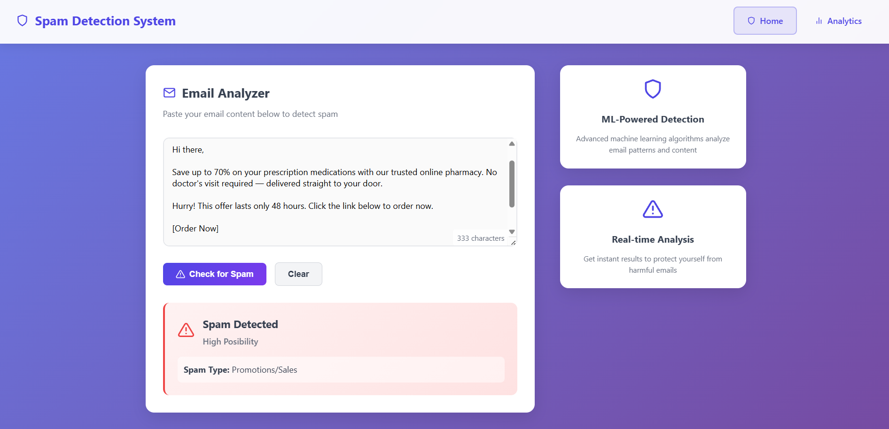
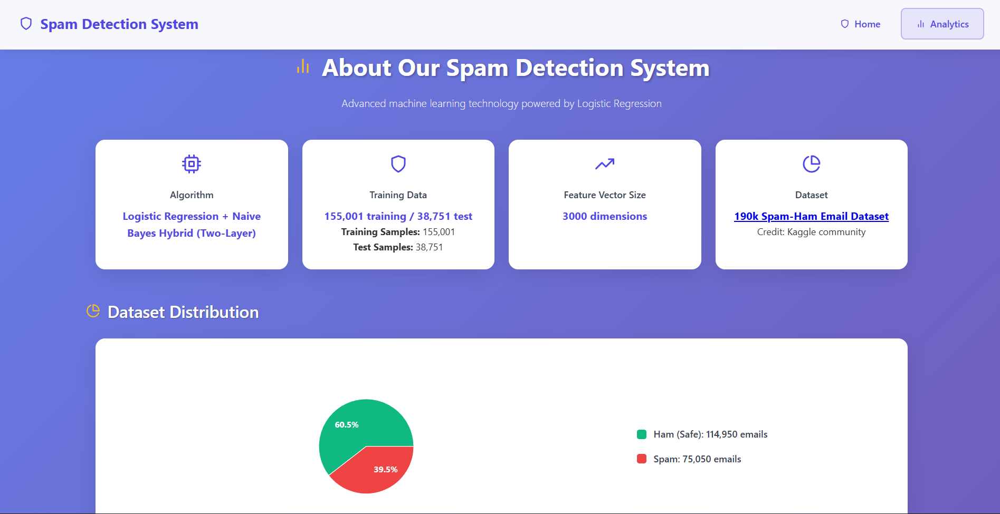
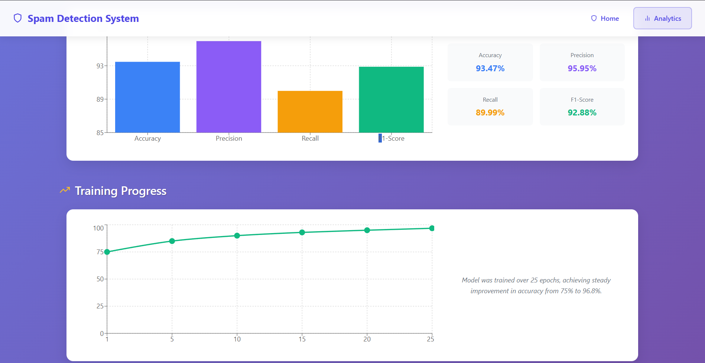
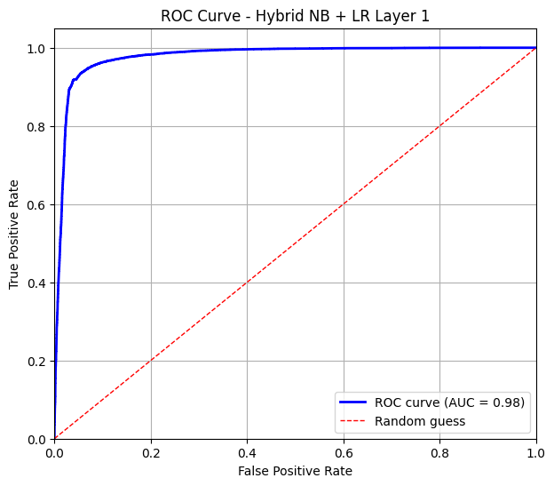
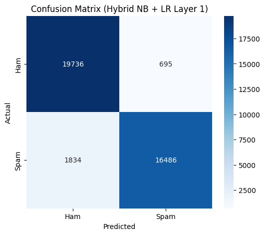
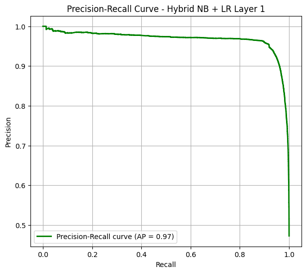

# 🔒 AI-Powered Spam Mail Detection System

A modern web application powered by machine learning to detect spam emails with high accuracy using Logistic Regression algorithm. This is a complete full-stack implementation with FastAPI backend and React frontend.


## 🌟 Features

- **🎯 High Accuracy**: 93.47% overall accuracy
- **⚡ Real-time Analysis**: Instant email analysis and classification
- **📊 Data Visualization**: Interactive charts showing dataset statistics and model performance
- **🎨 Modern UI/UX**: Beautiful, responsive design with professional styling
- **📱 Mobile Friendly**: Optimized for desktop, tablet, and mobile devices
- **🔧 Easy Setup**: Simple installation and configuration process

## 📊 Model Performance

- **Total Dataset**: 190,000+ emails
- **Training Samples**: 155,001
- **Test Samples**: 38,751
- **Accuracy**: 93.47%
- **Precision**: 95.95%
- **Recall**: 89.99%
- **F1-Score**: 92.88%

**Dataset:** This project uses the [190k Spam-Ham Email Dataset](https://www.kaggle.com/datasets/meruvulikith/190k-spam-ham-email-dataset-for-classification) for training and testing. Credit to the dataset authors and the Kaggle community.


## 📸 Screenshots

> Images are stored in the `docs/` folder.

### Homepage (main interface)


### Analytics Dashboard – Top Section


### Analytics Dashboard – Bottom Section


### ROC Curve


### Confusion Matrix


### Precision-Recall Curve


## 🛠️ Technology Stack

### Backend
- **Python 3.8+**
- **FastAPI** - Modern, fast web framework
- **Scikit-learn** - Machine learning library
- **NLTK** - Natural language processing
- **Joblib** - Model serialization
- **Uvicorn** - ASGI server

### Frontend
- **React 18**
- **React Router** - Client-side routing
- **Recharts** - Data visualization
- **React Icons** - Icon library
- **Axios** - HTTP client

### Machine Learning
- **Logistic Regression** - Two-layer classification
- **TF-IDF Vectorization** - Text feature extraction
- **Preprocessing Pipeline** - Text cleaning and normalization

## 📁 Project Structure

```
spam-mail-detection/
├── backend/
│   ├── models/                 # Trained ML models
│   │   ├── layer1_logreg_model.pkl
│   │   ├── layer2_logreg_model.pkl
│   │   ├── vectorizer_layer1.pkl
│   │   └── vectorizer_layer2.pkl
│   ├── main.py                # FastAPI application
│   ├── utils.py               # Text preprocessing utilities
│   ├── requirements.txt       # Python dependencies
│   └── venv/                  # Virtual environment
├── frontend/
│   ├── public/                # Static assets
│   ├── src/
│   │   ├── components/        # Reusable components
│   │   ├── pages/            # Page components
│   │   ├── App.js            # Main App component
│   │   └── App.css           # Styles
│   ├── package.json          # Node.js dependencies
│   └── package-lock.json
├── .gitignore                # Git ignore rules
├── env.example               # Environment variables template
└── README.md                # Project documentation
```

## 🚀 Quick Start

### Prerequisites

- Python 3.8 or higher
- Node.js 14 or higher
- npm or yarn

### Installation

1. **Clone the repository**
   ```bash
   git clone https://github.com/dev-jesu/spam-mail-detection.git
   cd spam-mail-detection
   ```

2. **Setup Environment Variables**
   ```bash
   cp env.example .env
   # Modify .env with your configuration
   ```

3. **Setup Backend**
   ```bash
   cd backend
   python -m venv venv
   
   # Windows
   venv\Scripts\activate
   
   # macOS/Linux
   source venv/bin/activate
   
   pip install -r requirements.txt
   ```

4. **Model Files**
   
   ✅ **Ready to use**: The trained ML model files are included in the repository (total size: ~0.5MB):
   
   - `layer1_logreg_model.pkl` (~40KB) - Binary classification (Ham vs Others)
   - `layer2_logreg_model.pkl` (~157KB) - Spam type classification  
   - `vectorizer_layer1.pkl` (~184KB) - TF-IDF vectorizer for layer 1
   - `vectorizer_layer2.pkl` (~183KB) - TF-IDF vectorizer for layer 2
   
   No additional downloads required!

5. **Setup Frontend**
   ```bash
   cd frontend
   npm install
   ```

### Running the Application

1. **Start the Backend Server**
   ```bash
   cd backend
   venv\Scripts\activate  # Windows
   source venv/bin/activate  # macOS/Linux
   
   uvicorn main:app --reload --host 127.0.0.1 --port 8000
   ```

2. **Start the Frontend Development Server**
   ```bash
   cd frontend
   npm start
   ```

3. **Access the Application**
   - Frontend: http://localhost:3000
   - Backend API: http://127.0.0.1:8000
   - API Documentation: http://127.0.0.1:8000/docs

## 📖 API Documentation

### Endpoints

- `GET /` - Health check endpoint
- `POST /predict` - Analyze email for spam detection
- `GET /stats` - Get dataset statistics and model metrics

### Request/Response Examples

#### Predict Spam
```bash
curl -X POST "http://127.0.0.1:8000/predict" \
     -H "Content-Type: application/json" \
     -d '{"message": "You have won $1000! Click here to claim now!"}'
```

Response:
```json
{
  "label": "Spam",
  "spam_type": "promotional",
  "confidence": "High Risk"
}
```

#### Get Statistics
```bash
curl "http://127.0.0.0:8000/stats"
```

## 🙌 Acknowledgements

- Dataset: [190k Spam-Ham Email Dataset](https://www.kaggle.com/datasets/meruvulikith/190k-spam-ham-email-dataset-for-classification)
  - Credit to the original dataset authors and the Kaggle community.
- Tech stack and libraries: FastAPI, React, Scikit-learn, NLTK, Uvicorn, Recharts.

## 🔧 Development

### Backend Development

1. **Virtual Environment Setup**
   ```bash
   cd backend
   python -m venv venv
   source venv/bin/activate  # or venv\Scripts\activate on Windows
   pip install -r requirements.txt
   ```

2. **Running Tests**
   ```bash
   # Add test commands here
   pytest tests/
   ```

### Frontend Development

1. **Development Mode**
   ```bash
   cd frontend
   npm install
   npm start
   ```

2. **Building for Production**
   ```bash
   npm run build
   ```

---

---

## 🙏 Thank You

Thank you for visiting this project! Feel free to explore, contribute, or use it to make email communication safer and smarter.
